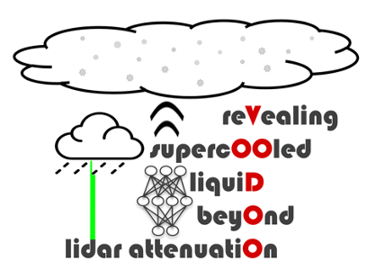
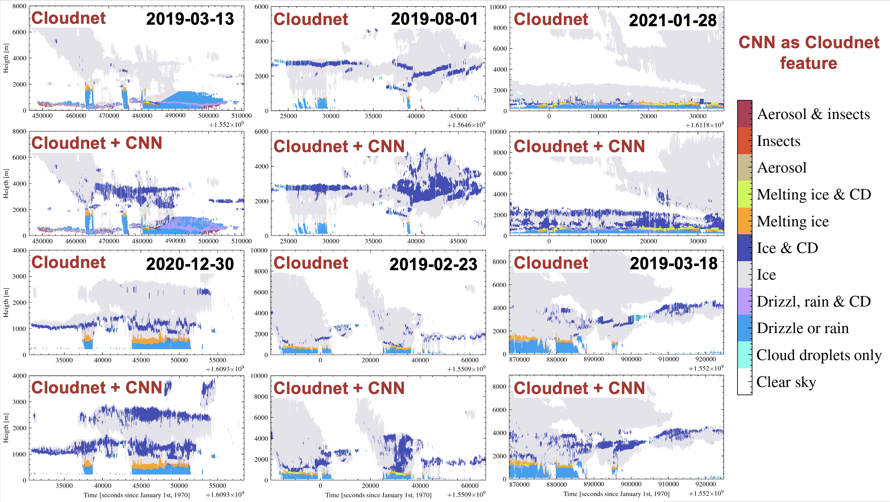

<div id="top"></div>
<!--
*** Thanks for checking out the Best-README-Template. If you have a suggestion
*** that would make this better, please fork the repo and create a pull request
*** or simply open an issue with the tag "enhancement".
*** Don't forget to give the project a star!
*** Thanks again! Now go create something AMAZING! :D
-->


<!-- PROJECT SHIELDS -->
<!--
*** I'm using markdown "reference style" links for readability.
*** Reference links are enclosed in brackets [ ] instead of parentheses ( ).
*** See the bottom of this document for the declaration of the reference variables
*** for contributors-url, forks-url, etc. This is an optional, concise syntax you may use.
*** https://www.markdownguide.org/basic-syntax/#reference-style-links
-->

[![Release][release-shield]][release-url]
[![DOI][zenodo-shield]][zenodo-url]
[![MIT License][license-shield]][license-url]
[](https://twitter.com/RSAtmos_LIM)


<!-- PROJECT LOGO -->
<br />
<div align="center">
  <a href="https://github.com/remsens-lim/Voodoo">
    
  </a>

  <h3 align="center">VOODOO</h3>

  <p align="center">
	Revealing supercooled liquid beyond lidar attenuation
    <br />
    <a href="https://github.com/remsens-lim/Voodoo"><strong>Explore the docs »</strong></a>
    <br />
    <br />
    <a href="https://github.com/remsens-lim/Voodoo/issues">Report Bug</a>
    ·
    <a href="https://github.com/remsens-lim/Voodoo/issues">Request Feature</a>
  </p>
</div>


<!-- TABLE OF CONTENTS -->
<details>
  <summary>Table of Contents</summary>
  <ol>
    <li>
      <a href="#about-the-project">About The Project</a>
      <ul>
        <li><a href="#built-with">Built With</a></li>
      </ul>
    </li>
    <li>
      <a href="#getting-started">Getting Started</a>
      <ul>
        <li><a href="#prerequisites">Prerequisites</a></li>
        <li><a href="#installation">Installation</a></li>
      </ul>
    </li>
    <li><a href="#usage">Usage</a></li>
    <li><a href="#roadmap">Roadmap</a></li>
    <li><a href="#contributing">Contributing</a></li>
    <li><a href="#license">License</a></li>
    <li><a href="#contact">Contact</a></li>
    <li><a href="#acknowledgments">Acknowledgments</a></li>
  </ol>
</details>


<!-- ABOUT THE PROJECT -->
## About The Project VOODOO

Machine learning approach using a convolutional neural network (CNN) classifier to relate Doppler spectra morphologies to the presence of (supercooled) liquid cloud droplets in mixed-phase clouds. Preprint will be available soon!

The release version provides the pre-trained machine learning model. Predictions are made by providing a list of Doppler radar time-spectrograms with dimensions: 
* number of spectral bins = 256
* number of time steps = 6 (equivalent to 30 sec of observations)

The model was trained on <a href="https://www.radiometer-physics.de/products/microwave-remote-sensing-instruments/94-ghz-fmcw-doppler-cloud-radar/">RPG-FMCW94</strong></a> data collected during <a href="https://dacapo.tropos.de/index.php/locations/15-dacapo-peso">DACAPO-PESO</strong></a>, therefore we recommend using this device for analysis. Supervision and validiation is provided by the <a href="https://github.com/actris-cloudnet/cloudnetpy">CloudnetPy</strong></a> target classification and detection status.

Two examples are provided:

* RPG-FMCW94 Doppler cloud radar `Voodoo_predictor_RPG-FMCW94.ipynb` test data is provided in the examples_data folder. The script requires a (hourly) LV0 binary file from RPG-FMCW94 and the corresponding Cloundet categorization file (for quicklooks and temporal resolution).
* for KAZR Doppler cloud radar: `Voodoo_predictor_KAZR.ipynb`
* help me test and add more devices :)


The CNN will ultimately be a feature within the Cloudnet processing suite. 

<div align="center">
  <h3 align="center">Some examples of enhancend Cloudnet mixed-phase detection </h3>
  <a href="https://github.com/remsens-lim/Voodoo">
    
  </a>
</div>

<p align="right">(<a href="#top">back to top</a>)</p>


<!-- GETTING STARTED -->
## Getting Started

The examples given use hourly radar spectra files in there specific file formats, i.e. LV0 binaries form RPG-FMCW94 and NetCDF files from KAZR. Th Cloudnet categorization file provides the temporal resolution where the high resolution radar profiels are mappend onto the 30 sec Cloudnet grid. Additionately, radar reflectivity and attenuated backscatter coefficient are plotted. 


### Installation

_Below is an example of how run the example script, which prepares the data, makes predictions and plots quicklooks. This method relies on external dependencies such as torch, xarray and others (see `setup.py`)._

1. Clone the repo
   ```sh
   git clone https://github.com/remsens-lim/Voodoo.git
   ```

2. Install the package
   ```sh
   python setup.py install
   ```

<p align="right">(<a href="#top">back to top</a>)</p>


<!-- USAGE EXAMPLES -->
## Examples

Use this space to show useful examples of how a project can be used. Additional screenshots, code examples and demos work well in this space. You may also link to more resources.

1. Open jupyter notebook
   ```sh
   jupyter notebook
   ```
2. Open one of the example files `Voodoo_predictor_KAZR.ipynb`or `Voodoo_predictor_RPG-FMCW94.ipynb` to review the processing chain.


<p align="right">(<a href="#top">back to top</a>)</p>


<!-- ROADMAP -->
## Roadmap

- [x] Released version 1
- [x] Add Tests
- [ ] ???

See the [open issues](https://github.com/KarlJohnsonnn/Voodoo/blob/release_v1/issues) for a full list of proposed features (and known issues).

<p align="right">(<a href="#top">back to top</a>)</p>


<!-- CONTRIBUTING -->
## Contributing

Any contributions you make are **greatly appreciated**.

If you have a suggestion that would make this better, please fork the repo and create a pull request. You can also simply open an issue with the tag "enhancement".
Don't forget to give the project a star! Thanks again!

1. Fork the Project
2. Create your Feature Branch (`git checkout -b feature/AmazingFeature`)
3. Commit your Changes (`git commit -m 'Add some AmazingFeature'`)
4. Push to the Branch (`git push origin feature/AmazingFeature`)
5. Open a Pull Request

<p align="right">(<a href="#top">back to top</a>)</p>


<!-- LICENSE -->
## License

Distributed under the MIT License. See `LICENSE` for more information.

<p align="right">(<a href="#top">back to top</a>)</p>


<!-- CONTACT -->
## Contact

Willi Schimmel - [@KarlJohnsonnn](https://twitter.com/KarlJohnsonnn) - willi.schimmel@uni-leipzig.de

Project Link: [https://github.com/remsens-lim/Voodoo](https://github.com/remsens-lim/Voodoo)

<p align="right">(<a href="#top">back to top</a>)</p>


<!-- ACKNOWLEDGMENTS -->
## Acknowledgments

Special thanks for templates and help during implementation.

* [Readme Template](https://github.com/othneildrew/Best-README-Template)
* [TROPOS (Remote-sensing) GitHub](https://github.com/lacros-tropos)
* [CloudnetPy GitHub](https://github.com/actris-cloudnet/cloudnetpy)
* [rpgPy GitHub](https://github.com/actris-cloudnet/rpgpy)

<p align="right">(<a href="#top">back to top</a>)</p>


<!-- MARKDOWN LINKS & IMAGES -->
<!-- https://www.markdownguide.org/basic-syntax/#reference-style-links -->

[zenodo-shield]: https://img.shields.io/badge/doi-10.5281%2Fzenodo.5970206-lightgrey?style=for-the-badge&logo=appveyor
[zenodo-url]: https://zenodo.org/badge/latestdoi/455474009

[release-shield]: https://img.shields.io/github/downloads/remsens-lim/Voodoo/v1.0.0/total?style=for-the-badge
[release-url]: https://zenodo.org/badge/latestdoi/455474009

[license-shield]: https://img.shields.io/github/license/othneildrew/Best-README-Template.svg?style=for-the-badge
[license-url]: https://github.com/remsens-lim/Voodoo/LICENSE

[product-screenshot]: Voodoo/voodoo_logo.png
