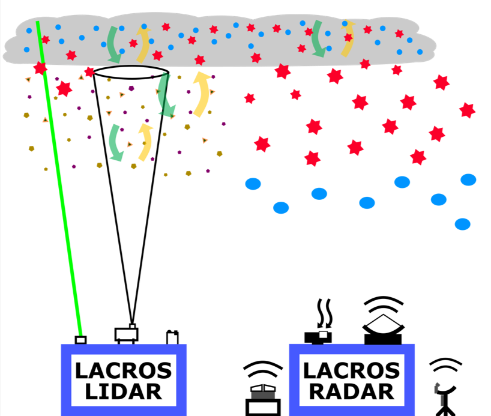
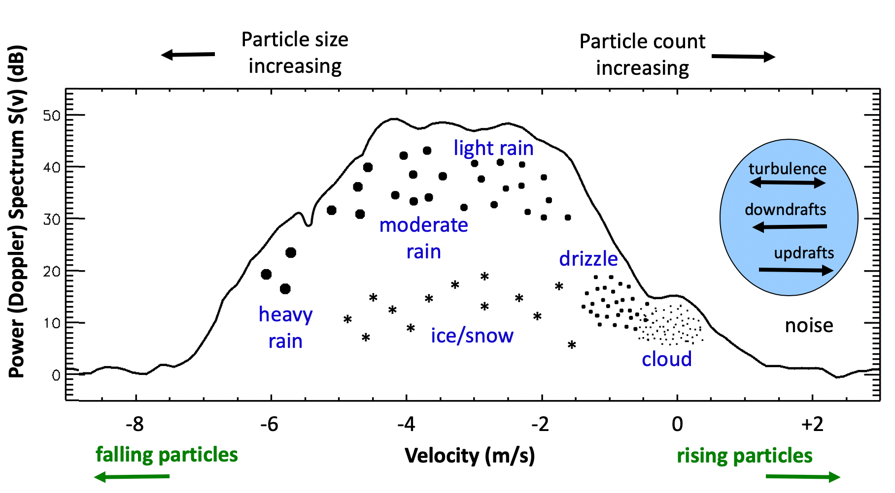
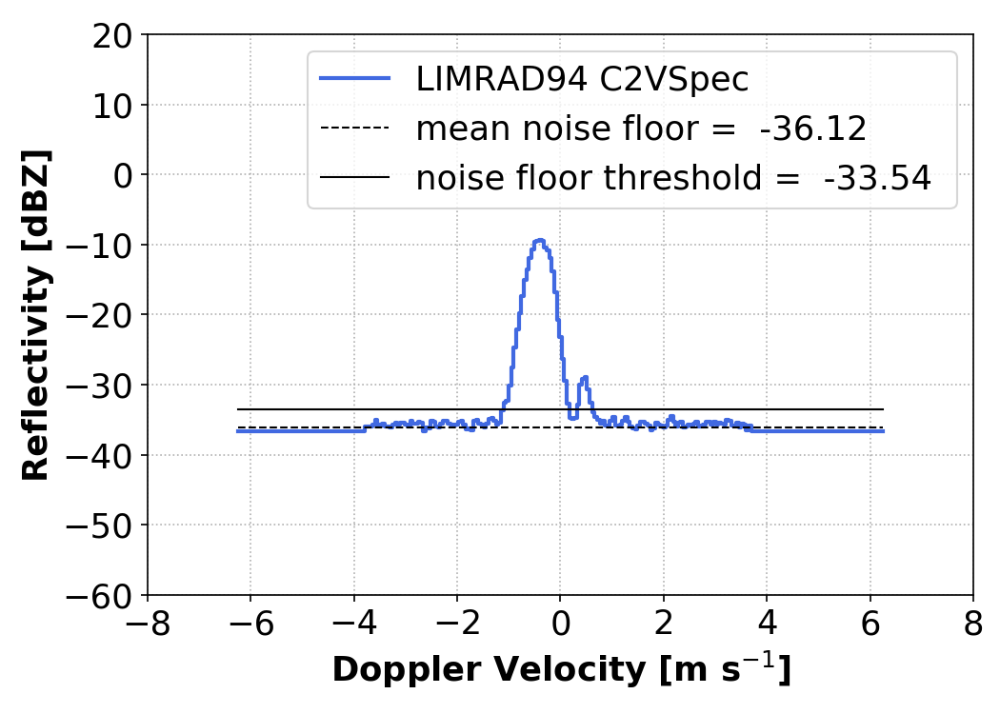
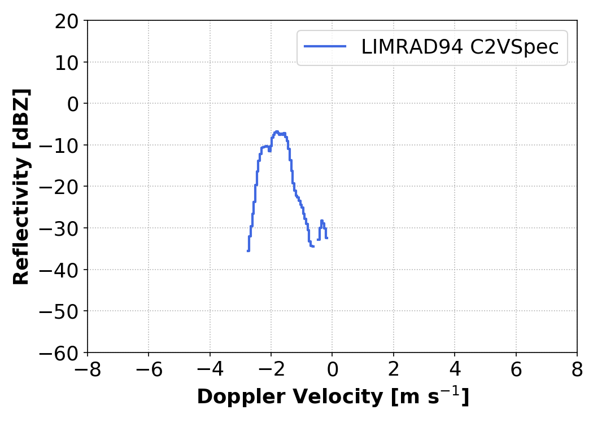
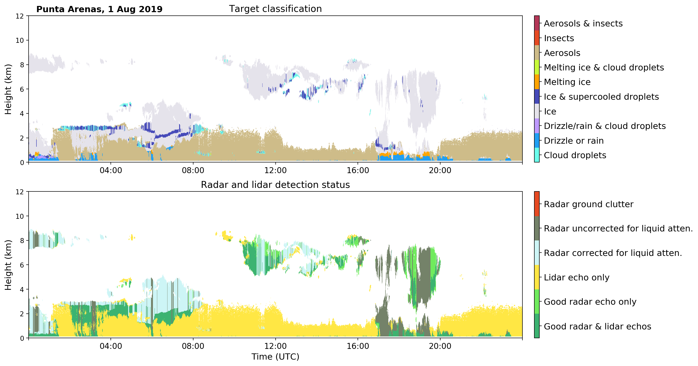
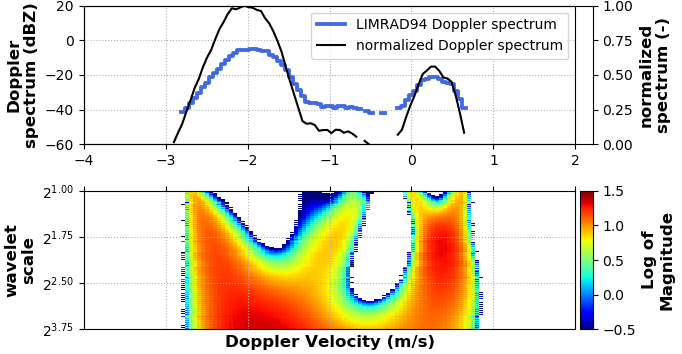

# <u>Hydrometeor Classification using Tensorflow</u>

_Several radar Doppler spectrum-based deconvolution approaches have been developed to extract cloud liquid drop and precipitation information from liquid clouds [Gossard, 1994; Gossard et al., 1997; Babb et al., 1999]. Shupe and Intrieri [2004] and Rambukkange et al. [2011] use peak detection algorithms to separate liquid and ice spectral modes when radar Doppler spectra are bimodal in mixed-phase cloud cases. However, clear separations between cloud liquid drop and precipitation peaks are not frequently observed for precipitation populations with small fall speeds (e.g., drizzle and/or small ice particle precipitation), and the small cloud liquid drop contributions must be identified before they can be extracted. This study builds on the work of Luke et al. [2010] who demonstrated the ability of a continuous wavelet transform (CWT) analysis to detect subtle features in radar Doppler spectra and the recent study by Luke and Kollias [2013] who proposed a new radar Doppler spectrum decomposition approach based on assumed Gaussian-shaped cloud liquid drop contributions to the radar Doppler spectra. The work of Yu et al. [2014] extends the application of their analysis to mixed-phase spectra where the dominant contribution to the total reflectivity comes from ice precipitation._

[Yu et al 2014]

### RPG-FMCW 94 GHz Doppler Cloud Radar

A new 94-GHz frequency-modulated continuous wave (FMCW) Doppler radar–radiometer system [Leipzig Institute for Meteorology (LIM) Radar–94 GHz (LIMRAD94)] that was operating 10 months in the prestine enviroment of the souther ocean at the [Universidad de Magallanes](http://www.umag.cl/en/) Punta Arenas, Chile. 

### Technical sketch of LACROS

	

### Cloud Radar Doppler spectra

The radar Doppler spectrum is assumed to be a superposition of multiple Gaussian distributions. The example below shows one measurement containing a velocity resolved power spectrum. 

	
    <figcaption>
    Figure 1: Schematic representation of a cloud radar Doppler spectrum. The x-y position of the individual hydrometeor class represents the signal intensity and terminal fall velocity of the particles. [source Ed Luke?]
	</figcaption>

_**Figure 1*** demonstrates the evolution of radar signals as different classes of hydrometeors from cloud base to cloud top contribute to them. The left column shows simulated radar Doppler spectra generated from model output using a forwardmodel radar simulator. The cloud liquid drop signal (in red) generally increases from cloud base to cloud top because of the increase in liquid water with adiabatic ascent. Near cloud top, the majority of the signal comes from cloud liquid drops because ice particle concentrations are low and particles are small. The ice particles grow as they fall through the ice-supersaturated cloud; hence, signals from ice particles increase with decreasing height. These simulated radar Doppler spectra may be compared to the observed radar Doppler spectra in the right column. The local maxima on the right sides of these observed spectra are likely contributed by cloud liquid drops. However, the cloud liquid drop signal can be ambiguous, masked by noise or ice particle signals, as is evident in the top spectrum of the right column. These simple examples show that a sophisticated method to detect and separate the cloud liquid drop signal from the total signal is required to extract vertical profiles of liquid microphysical properties within mixed-phase clouds from radar Doppler spectra._

	
	<figcaption>
	Yu et al. 2014 “Mixed‐phase cloud phase partitioning using millimeter wavelength cloud radar Doppler velocity spectra” https://agupubs.onlinelibrary.wiley.com/doi/full/10.1002/2013JD021182-->
	</figcaption>

## 1. Methodology

The new approach further exteds the ideas of [Luke et al. 2010](https://www.esrl.noaa.gov/psd/people/matthew.shupe/publications/Lukeetal.2010JGR.pdf) and [Yu et al. 2014](https://journals.ametsoc.org/doi/pdf/10.1175/AMSMONOGRAPHS-D-17-0001.1), incooperating the latest technological developments in machine learning both in [GPU accelerated hardware from NVIDIA](https://www.nvidia.com/en-us/design-visualization/quadro/rtx-8000/) and open source software such as [Tensorflow](https://www.tensorflow.org/) and [Keras](https://keras.io/). The general idea is to utilises the spectral information of vertical pointing Doppler cloud radar observations to generate a hydrometeor classification in a similar manner as Cloudnet, see [Illingoworth et al. 2007](https://journals.ametsoc.org/doi/abs/10.1175/BAMS-88-6-883).

### 1.1 Major limitations of current techniques

-   liquid cloud droplets detection beyond attenuated lidar/ceilometer (only possible in Cloudnet if lidar signal is valid)

-   applicable for all vertical pointing Doppler cloud radars with a mimimum temporal resolution of 10 [sec], minimum range 50 [m] and a sensitivity limit below -30 [dBZ]

### 1.2 Data

The following three data sources are used for the training period of the neural net:

-   **cloud radar Doppler spectra**   in 3D array shape with the dimensions , where  is the number sampling times (depends time span and temporal resolution of the radar),  the number of range gates (depending on the vertial range resolution) and  the number of velocity bins (depending on the chirp table settings)

    

      
    	
      <figcaption>
        Figure 3: Spectra from 10. January 2019 in Punta Arenas, Chile. Left: 13:00 UTC at 4770m, settings: spectral-compression-off, noise-factor-0.
        Right: 19:10 UTC at 4740m altitude, settings: spectral-compression-on, noise-factor-6.
    	</figcaption>
    

    

    

-   **Cloudnet target classification**   in 2D array shape with  dimensions  contains the different classes the range of integer values from 0 to 10
    
    0.  Clear sky
    1.  Cloud liquid droplets only.
    2.  Drizzle or rain.
    3.  Drizzle or rain coexisting with cloud liquid droplets.
    4.  Ice particles.
    5.  Ice coexisting with supercooled liquid droplets.
    6.  Melting ice particles.
    7.  Melting ice particles coexisting with cloud liquid droplets
    8.  Aerosol particles, no cloud or precipitation.
    9.   Insects, no cloud or precipitation.
10.  Aerosol coexisting with insects, no cloud or precipitation.
    
-   **Cloudnet detection status**  in 2D array shape with dimensions  contains the detection status in the range of integer values from 0 to 7

     0. Clear sky.
     1. Good radar and lidar echos.
        2. Good radar echo only.
        3. Radar echo, corrected for liquid attenuation.
        4. Lidar echo only.
        5. Radar echo, uncorrected for liquid attenuation.
        6. Radar ground clutter.
        7. Lidar clear-air molecular scattering.

	
    <figcaption>
    Figure 2: Top: Cloudnet target classification for 1. August 2019 in Punta Arenas, Chile. Bottom: Cloudnet detection status.
	</figcaption>

### 1.3 Feature Extraction

Assuming a Gaussian distribution of the radar signal, similar to  [Luke et al. 2010](https://www.esrl.noaa.gov/psd/people/matthew.shupe/publications/Lukeetal.2010JGR.pdf) and [Yu et al. 2014](https://journals.ametsoc.org/doi/pdf/10.1175/AMSMONOGRAPHS-D-17-0001.1), a continuouse wavelet transformation (CWT) is used to create a 2D representation of a particular Doppler spectrum. 

	
  <figcaption>
    Figure 1: Continuouse wavelet transformation of a Doppler radar spectrum containing a supercooled liquid and two ice particle populations. Spectrum from 1. August 2019 in Punta Arenas, 6:45 UTC at 2900 m altitude in blue. Normalized in black. Bottom: Continuouse wavelet transformation ot the above signal for 32 scaling parameters.
	</figcaption>

Since the temporal resolution of Cloudnet products is ~30 [sec] we try to increase the information content per sample by applying different technquies to create the input tensor for the neural network:

1.  For each Cloudnet timestep , average  spectra: , 

    where $\bigtriangleup t_{\mathrm{cn}}=30$ [sec] is the temporal resolution of Cloudnet products, and $\bigtriangleup t_{\mathrm{rdr}}$ the cloud radar resolution respectivley. The CWT is then performed with the averaged spectrum $\left\langle \mathcal{S} \right\rangle$. Using $n_s=32$ scales for the CWT feauture extraction, the resulting input Tensor is a _greyscale_ image with the overall resulting tensor dimension of  $\mathrm{N}=(n_{\mathrm{smpl}},\, n_{v},\, n_{s}, 1)$.

2.  For each Cloudnet timestep , concatinate  channels of CWT into one sample, which leads to an increase in the resulting tensor dimension as follows .

The automatic selection of _trustworthy_ samples from all possible radar returns is done using the Cloudnet target classification and the detection status . The training set is selected as follows:

,

where  represent the dataset (featue samples and labels) for the group of indices  that obey the following equation

.

### 1.4 Artificial Neural Network

The type of ANN used for this work is called convolutional neural network. The input, usually an image, is processed* in the neural network to transform the information of the image into an class label.

### 1.5 Preliminary Results

The date used is the 1. August 2019 in Punta Arenas, Chile. This day was not used for training and is used here as visual validation of the performance of the Conv2D classifier.

##### Cloudnet Target Classification

##### Radar-Only Conv2D Classifier

Shown below are predictions of hydrometor classes for different hyperparameter configurations and training sets.

![prediction_20190801_0459-0901__4-cl--2_2-ks--relu-af--adam-opt--CategoricalCrossentropy-loss--64-bs--50-ep--0.0001-lr--1e-05-dr--1-dl--[64]-dn--multispectra--20200311-161425.h5](/Users/willi/code/python/larda3/voodoo/plots/training/20190313_1001-1559/prediction_20190801_0459-0901__4-cl--2_2-ks--relu-af--adam-opt--CategoricalCrossentropy-loss--64-bs--50-ep--0.0001-lr--1e-05-dr--1-dl--[64]-dn--multispectra--20200311-161425.h5.png)

![prediction_20190801_0459-0901__4-cl--2_2-ks--relu-af--adam-opt--CategoricalCrossentropy-loss--64-bs--25-ep--0.001-lr--1e-05-dr--1-dl--[64]-dn--20200306-213906.h5_wibn](/Users/willi/code/python/larda3/voodoo/plots/training/20190313_1001-1559/prediction_20190801_0459-0901__4-cl--2_2-ks--relu-af--adam-opt--CategoricalCrossentropy-loss--64-bs--25-ep--0.001-lr--1e-05-dr--1-dl--[64]-dn--20200306-213906.h5_wibn.png)

![prediction_20190801_0459-0901__4-cl--2_2-ks--relu-af--adam-opt--CategoricalCrossentropy-loss--42-bs--25-ep--0.001-lr--1e-05-dr--1-dl--[64]-dn--20200306-180520.h5](/Users/willi/code/python/larda3/voodoo/plots/training/20190313_1001-1559/prediction_20190801_0459-0901__4-cl--2_2-ks--relu-af--adam-opt--CategoricalCrossentropy-loss--42-bs--25-ep--0.001-lr--1e-05-dr--1-dl--[64]-dn--20200306-180520.h5.png)

![prediction_20190801_0459-0901__4-cl--2_2-ks--relu-af--adam-opt--CategoricalCrossentropy-loss--32-bs--20-ep--0.0001-lr--1e-05-dr--1-dl--[64]-dn--20200306-173000.h5](/Users/willi/code/python/larda3/voodoo/plots/training/20190313_1001-1559/prediction_20190801_0459-0901__4-cl--2_2-ks--relu-af--adam-opt--CategoricalCrossentropy-loss--32-bs--20-ep--0.0001-lr--1e-05-dr--1-dl--[64]-dn--20200306-173000.h5.png)

![prediction_20190801_0459-0901__4-cl--2_2-ks--relu-af--adam-opt--CategoricalCrossentropy-loss--64-bs--20-ep--0.001-lr--1e-05-dr--1-dl--[64]-dn--20200306-171252.h5](/Users/willi/code/python/larda3/voodoo/plots/training/20190313_1001-1559/prediction_20190801_0459-0901__4-cl--2_2-ks--relu-af--adam-opt--CategoricalCrossentropy-loss--64-bs--20-ep--0.001-lr--1e-05-dr--1-dl--[64]-dn--20200306-171252.h5.png)

![prediction_20190801_0459-0901__3-cl--3_3-ks--relu-af--adam-opt--CategoricalCrossentropy-loss--16-bs--50-ep--0.0001-lr--1e-05-dr--1-dl--[64]-dn--20200301-152259.h5](/Users/willi/code/python/larda3/voodoo/plots/training/20190313_1001-1559/prediction_20190801_0459-0901__3-cl--3_3-ks--relu-af--adam-opt--CategoricalCrossentropy-loss--16-bs--50-ep--0.0001-lr--1e-05-dr--1-dl--[64]-dn--20200301-152259.h5.png)

It clear that all combinations of hyperparameter produce a different classification. Nevertheless, the mixed-phase area between 6 UTC and 7 UTC between 2 and 3 km altitude is clearly visible in all of the models. This is a visible prove that the ANN was able to generalize well, to a certain degree.